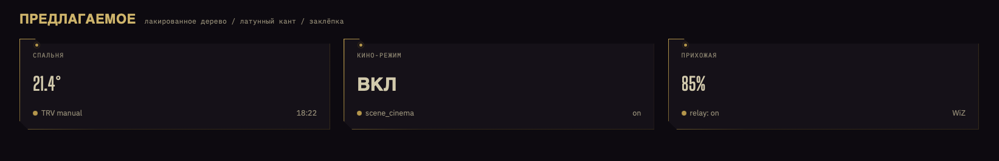

# Deus Ex — Home Assistant theme

A dark gold / brass reskin of the [cyberpunk-2077](https://github.com/flejz/hass-cyberpunk-2077-theme)
Home Assistant theme. Muted amber accents (`#C79238` / `#D4A93A`), lacquered‑wood card
surfaces, brass hairline trim, cut corners and rivet studs.

Used on the **Дом Beta** floorplan dashboard.



## Install

### Manual
1. Copy `themes/deus-ex.yaml` to `<config>/themes/deus-ex.yaml` on your HA host.
2. Make sure `configuration.yaml` has:
   ```yaml
   frontend:
     themes: !include_dir_merge_named themes
   ```
3. Restart HA (or **Developer Tools → YAML → Reload Themes**).
4. Pick **Deus Ex** in your profile, or set it per‑dashboard with `theme: Deus Ex`.

### HACS (custom repository)
Add `https://github.com/Aamoree99/ha-deus-ex-theme` as a **Theme** custom repository.

## Requirements

- [card-mod](https://github.com/thomasloven/lovelace-card-mod) — the card frame, brass
  border, rivet and sidebar styling are all card-mod CSS. Without it you still get the
  colour palette, just no decorative frame.

## Background

The page background is driven **by the theme**, not per‑view config:

```yaml
background-image: "center / cover no-repeat fixed url('https://raw.githubusercontent.com/Aamoree99/ha-deus-ex-theme/main/assets/background.jpg')"
lovelace-background: "var(--background-image)"
```

To change the wallpaper: replace `assets/background.jpg`, commit, push. HA picks it up
after the GitHub CDN cache expires (~5 min) and a browser refresh. For an instant local
override, drop the file at `<config>/www/deus-ex/background.jpg` and point
`background-image` at `/local/deus-ex/background.jpg`.

## Palette

| var | value | role |
|-----|-------|------|
| `cyan-color` | `#D4A93A` | primary accent (active state, selection) |
| `red-color` | `#C79238` | primary text / icons |
| `dark-cyan-color` | `#3A2E14` | deep gold |
| `dark-red-color` | `#332711` | card background base |
| `dark-purple-color` | `#140C15` | surfaces / sidebar |
| `orange-color` | `#FFA500` | `primary-color` |
| font | `Rajdhani, Roboto` | |

## Layout

```
themes/deus-ex.yaml      the theme
assets/background.jpg     wallpaper served to HA via GitHub raw
reference/                design references (not used by HA)
```

## Credit / License

Derived from **hass-cyberpunk-2077-theme** by [flejz](https://github.com/flejz), MIT.
This repository is MIT — see `LICENSE`.
